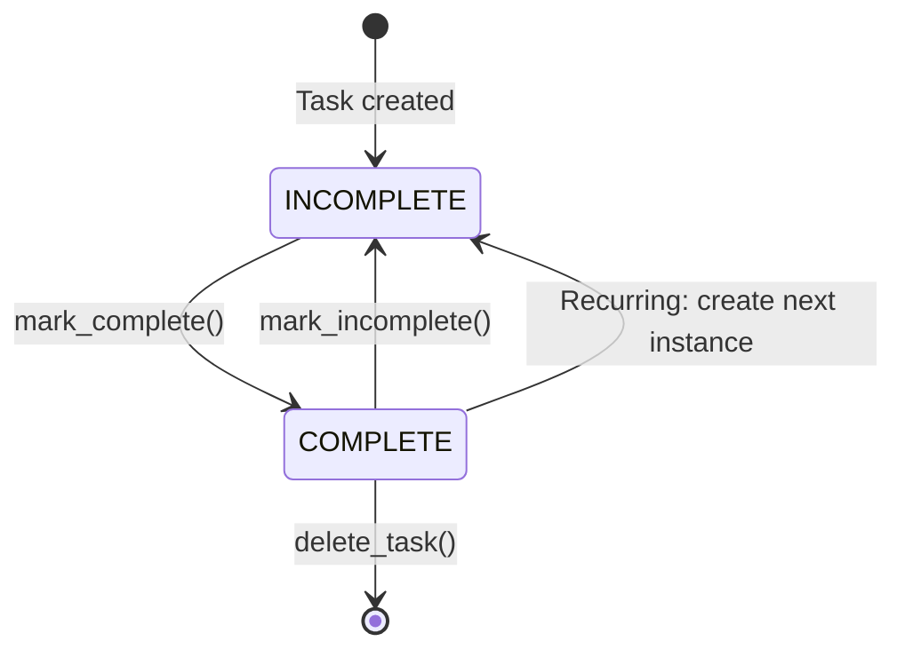

# Data Model: Advanced Features - Recurring Tasks and Due Date Reminders

**Date**: 2026-01-01
**Feature**: 001-advanced-features
**Purpose**: Detailed data model specifications for extending the Task entity with recurrence and reminder capabilities

---

## Entity: Task (Extended)

**Location**: `src/models/task.py`

**Purpose**: Represents a todo item with optional due date/time, recurrence pattern, and reminders

### Attributes

| Field | Type | Required | Default | Description |
|-------|------|----------|---------|-------------|
| `id` | `int` | Yes | Auto-assigned | Unique identifier |
| `title` | `str` | Yes | - | Task description (max 255 chars) |
| `description` | `str` | No | `""` | Detailed notes (max 2000 chars) |
| `status` | `TaskStatus` | Yes | `INCOMPLETE` | Completion state |
| `priority` | `TaskPriority` | Yes | `MEDIUM` | Priority level (high/medium/low) |
| `category` | `TaskCategory` | Yes | `UNCATEGORIZED` | Category (work/home/uncategorized) |
| `due_date` | `Optional[date]` | No | `None` | Due date (YYYY-MM-DD) |
| `due_time` | `Optional[time]` | No | `None` | **NEW**: Due time (HH:MM:SS) |
| `recurrence` | `Optional[RecurrencePattern]` | No | `None` | **NEW**: Recurrence configuration |
| `reminder_intervals` | `List[int]` | No | `[]` | **NEW**: Reminder offsets in minutes before due time |
| `completed_at` | `Optional[datetime]` | No | `None` | **NEW**: Timestamp when marked complete (for recurring tasks) |
| `parent_recurrence_id` | `Optional[int]` | No | `None` | **NEW**: ID of parent recurring task (for instances) |
| `created_at` | `datetime` | Yes | Auto | Creation timestamp (UTC) |
| `updated_at` | `datetime` | Yes | Auto | Last modification timestamp (UTC) |

### Validation Rules

1. **Title**:
   - Cannot be empty or whitespace-only
   - Maximum 255 characters
   - Validation: Raise `ValueError` on violation

2. **Description**:
   - Maximum 2000 characters
   - Validation: Raise `ValueError` on violation

3. **Due Date and Time**:
   - `due_time` can only be set if `due_date` is set
   - If `due_date` is None, `due_time` must be None
   - Validation: Raise `ValueError` if due_time set without due_date
   - Past dates are allowed (marked as overdue)

4. **Reminder Intervals**:
   - Each interval must be positive (> 0 minutes)
   - Cannot have reminders without a due date
   - Maximum 5 reminders per task
   - Validation: Raise `ValueError` on violation

5. **Recurrence**:
   - Recurrence pattern must be valid (interval > 0 days)
   - Recurring tasks should have a due date (recommended, not enforced)

6. **Parent Recurrence ID**:
   - If set, must reference an existing task ID
   - Used to track instances of recurring tasks

### Methods (Existing + New)

**Existing Methods** (retained from current implementation):
- `update_title(new_title: str) -> None`
- `update_description(new_description: str) -> None`
- `update_priority(priority: TaskPriority) -> None`
- `update_category(category: TaskCategory) -> None`
- `update_due_date(due_date: Optional[date]) -> None`
- `mark_complete() -> None`
- `mark_incomplete() -> None`
- `to_dict() -> dict`
- `from_dict(data: dict) -> Task` (classmethod)

**New Methods**:

```python
def update_due_time(self, due_time: Optional[time]) -> None:
    """Update the task due time. Requires due_date to be set."""
    if due_time is not None and self.due_date is None:
        raise ValueError("Cannot set due_time without due_date")
    self.due_time = due_time
    self.updated_at = datetime.now(timezone.utc)

def update_recurrence(self, recurrence: Optional[RecurrencePattern]) -> None:
    """Update the task recurrence pattern."""
    self.recurrence = recurrence
    self.updated_at = datetime.now(timezone.utc)

def set_reminder_intervals(self, intervals: List[int]) -> None:
    """Set reminder intervals (minutes before due time)."""
    if self.due_date is None:
        raise ValueError("Cannot set reminders without due_date")
    if len(intervals) > 5:
        raise ValueError("Maximum 5 reminders per task")
    if any(i <= 0 for i in intervals):
        raise ValueError("Reminder intervals must be positive")
    self.reminder_intervals = sorted(intervals, reverse=True)  # Largest first
    self.updated_at = datetime.now(timezone.utc)

def get_full_due_datetime(self) -> Optional[datetime]:
    """Combine due_date and due_time into a full datetime (local timezone)."""
    if self.due_date is None:
        return None
    time_component = self.due_time or time(23, 59, 59)
    return datetime.combine(self.due_date, time_component)

def is_overdue(self) -> bool:
    """Check if task is overdue (past due date/time and not complete)."""
    if self.status == TaskStatus.COMPLETE:
        return False
    due_dt = self.get_full_due_datetime()
    if due_dt is None:
        return False
    return datetime.now() > due_dt

def calculate_reminder_times(self) -> List[datetime]:
    """Calculate absolute times when reminders should fire."""
    due_dt = self.get_full_due_datetime()
    if due_dt is None or not self.reminder_intervals:
        return []
    return [due_dt - timedelta(minutes=interval) for interval in self.reminder_intervals]
```

### State Transitions



**Recurring Task Instance Creation**:
1. When a recurring task is marked complete:
   - Set `completed_at` timestamp
   - Create new task instance with:
     - Same title, description, priority, category, recurrence
     - New due_date = completed_at + recurrence interval
     - Same due_time (if set)
     - Same reminder_intervals
     - Status = INCOMPLETE
     - `parent_recurrence_id` = original task ID
     - New ID (auto-assigned)

### Backwards Compatibility

- Existing tasks without `due_time`, `recurrence`, `reminder_intervals`, etc. remain valid
- `to_dict()` and `from_dict()` handle missing fields gracefully
- Default values ensure old tasks work without modification

---

## Entity: RecurrencePattern

**Location**: `src/models/recurrence.py` (NEW FILE)

**Purpose**: Encapsulates recurrence logic for repeating tasks

### Attributes

| Field | Type | Required | Default | Description |
|-------|------|----------|---------|-------------|
| `interval_type` | `RecurrenceInterval` | Yes | - | Type of interval (DAILY, WEEKLY, MONTHLY, CUSTOM) |
| `interval_value` | `int` | Yes | `1` | Number of days for CUSTOM intervals (ignored for others) |

### Enum: RecurrenceInterval

```python
class RecurrenceInterval(Enum):
    DAILY = "daily"          # Repeat every day
    WEEKLY = "weekly"        # Repeat every 7 days
    MONTHLY = "monthly"      # Repeat every 30 days
    CUSTOM = "custom"        # Repeat every N days (interval_value)
```

### Methods

```python
def calculate_next_occurrence(self, from_date: datetime) -> datetime:
    """Calculate the next occurrence date based on the recurrence pattern.

    Args:
        from_date: The date to calculate from (typically completion date)

    Returns:
        The next occurrence datetime
    """
    if self.interval_type == RecurrenceInterval.DAILY:
        return from_date + timedelta(days=1)
    elif self.interval_type == RecurrenceInterval.WEEKLY:
        return from_date + timedelta(days=7)
    elif self.interval_type == RecurrenceInterval.MONTHLY:
        return from_date + timedelta(days=30)
    elif self.interval_type == RecurrenceInterval.CUSTOM:
        return from_date + timedelta(days=self.interval_value)

def to_dict(self) -> dict:
    """Serialize to dictionary."""
    return {
        "interval_type": self.interval_type.value,
        "interval_value": self.interval_value,
    }

@classmethod
def from_dict(cls, data: dict) -> "RecurrencePattern":
    """Deserialize from dictionary."""
    return cls(
        interval_type=RecurrenceInterval(data["interval_type"]),
        interval_value=data.get("interval_value", 1),
    )

def __str__(self) -> str:
    """Human-readable representation."""
    if self.interval_type == RecurrenceInterval.DAILY:
        return "Repeats daily"
    elif self.interval_type == RecurrenceInterval.WEEKLY:
        return "Repeats every 7 days"
    elif self.interval_type == RecurrenceInterval.MONTHLY:
        return "Repeats every 30 days"
    elif self.interval_type == RecurrenceInterval.CUSTOM:
        return f"Repeats every {self.interval_value} days"
```

### Validation Rules

- `interval_value` must be > 0 for CUSTOM type
- For DAILY, WEEKLY, MONTHLY, `interval_value` is ignored (default 1)

---

## Entity: Reminder (Internal Model)

**Location**: `src/models/reminder.py` (NEW FILE)

**Purpose**: Represents a scheduled reminder for a task (used internally by ReminderService)

### Attributes

| Field | Type | Required | Description |
|-------|------|----------|-------------|
| `task_id` | `int` | Yes | ID of the task this reminder is for |
| `reminder_time` | `datetime` | Yes | When to trigger the notification |
| `minutes_before` | `int` | Yes | How many minutes before due time |
| `sent` | `bool` | No | Whether notification was sent (default False) |

### Methods

```python
def is_due(self) -> bool:
    """Check if reminder should fire now."""
    return datetime.now() >= self.reminder_time and not self.sent

def mark_sent(self) -> None:
    """Mark reminder as sent."""
    self.sent = True

def __lt__(self, other: "Reminder") -> bool:
    """Comparison for priority queue (earlier reminders first)."""
    return self.reminder_time < other.reminder_time
```

### Usage Notes

- Reminders are created dynamically from Task.calculate_reminder_times()
- Not persisted separately - regenerated on app startup from tasks
- Used by ReminderService to schedule notifications

---

## Service: ReminderService

**Location**: `src/services/reminder_service.py` (NEW FILE)

**Purpose**: Background thread that checks for due reminders and sends notifications

### Key Responsibilities

1. Maintain priority queue of upcoming reminders
2. Poll every 10 seconds for due reminders
3. Send desktop notifications via plyer
4. Thread-safe access to task storage
5. Clean shutdown on app exit

### Key Methods

```python
def start(self) -> None:
    """Start the reminder checking thread."""

def stop(self) -> None:
    """Stop the reminder thread gracefully."""

def refresh_reminders(self) -> None:
    """Rebuild reminder queue from current tasks (called when tasks change)."""

def _check_reminders(self) -> None:
    """Background loop that checks for due reminders (runs in thread)."""

def _send_notification(self, task: Task, minutes_before: int) -> None:
    """Send desktop notification for a reminder."""
```

---

## Service: RecurrenceService

**Location**: `src/services/recurrence_service.py` (NEW FILE)

**Purpose**: Handles creation of recurring task instances

### Key Responsibilities

1. Create new task instance when recurring task is completed
2. Calculate next occurrence date
3. Copy task attributes to new instance
4. Set parent_recurrence_id for tracking

### Key Methods

```python
def create_next_instance(self, completed_task: Task, task_store) -> Task:
    """Create next instance of a recurring task after completion.

    Args:
        completed_task: The task that was just completed
        task_store: TaskStore to add the new instance to

    Returns:
        The newly created task instance
    """
    if completed_task.recurrence is None:
        raise ValueError("Task is not recurring")

    # Calculate next occurrence
    next_due = completed_task.recurrence.calculate_next_occurrence(
        completed_task.completed_at or datetime.now()
    )

    # Create new task instance
    # ... (copy attributes, set new due_date, etc.)
```

---

## Integration with Existing Code

### Changes to `src/models/task.py`

- Add new fields: `due_time`, `recurrence`, `reminder_intervals`, `completed_at`, `parent_recurrence_id`
- Add new methods: `update_due_time()`, `update_recurrence()`, `set_reminder_intervals()`, etc.
- Update `to_dict()` and `from_dict()` to handle new fields
- Update `__post_init__()` validation for new constraints

### No Changes Required to `src/storage/task_store.py`

- TaskStore already handles arbitrary Task objects
- No schema changes needed for in-memory storage
- Serialization/deserialization handled by Task.to_dict()/from_dict()

### Changes to `src/cli/commands.py`

- Extend `add` command with new flags (--due-time, --recurrence, --remind-before)
- Extend `update` command with new flags
- Extend `list` command with filtering and sorting options
- Start ReminderService on app initialization
- Stop ReminderService on app exit (atexit handler)

---

## Data Flow Examples

### Example 1: Adding a Task with Reminder

1. User runs: `todo add "Meeting" --due 2026-01-10 --due-time 10:00 --remind-before 15`
2. CLI parses arguments → creates Task with:
   - `due_date = date(2026, 1, 10)`
   - `due_time = time(10, 0)`
   - `reminder_intervals = [15]`
3. Task added to TaskStore
4. ReminderService.refresh_reminders() called
5. Reminder scheduled for 2026-01-10 09:45 (15 minutes before)
6. At 09:45, ReminderService sends desktop notification

### Example 2: Completing a Recurring Task

1. User runs: `todo complete 5` (task 5 is recurring weekly)
2. CLI calls task.mark_complete()
3. Task `completed_at` set to now
4. RecurrenceService.create_next_instance() called
5. New task created with:
   - Same title, description, priority, category, recurrence
   - New `due_date` = 7 days from completion
   - Same `due_time`, `reminder_intervals`
   - `parent_recurrence_id = 5`
6. New task added to TaskStore
7. ReminderService.refresh_reminders() called

### Example 3: Listing Overdue Tasks

1. User runs: `todo list --overdue`
2. CLI queries TaskStore for all tasks
3. Filter tasks where `task.is_overdue() == True`
4. Sort by due date (oldest first)
5. Display with overdue indicator (e.g., red text, "[OVERDUE]" tag)

---

## Summary

This data model extends the existing Task entity with:
- Time-aware due dates (`due_time` field)
- Recurrence patterns (new `RecurrencePattern` entity)
- Reminder scheduling (`reminder_intervals` list)
- Instance tracking for recurring tasks (`parent_recurrence_id`)

Two new services handle the complex logic:
- **ReminderService**: Background thread for notification delivery
- **RecurrenceService**: Logic for creating recurring task instances

The design maintains backwards compatibility with existing tasks while enabling powerful new time-management features.
